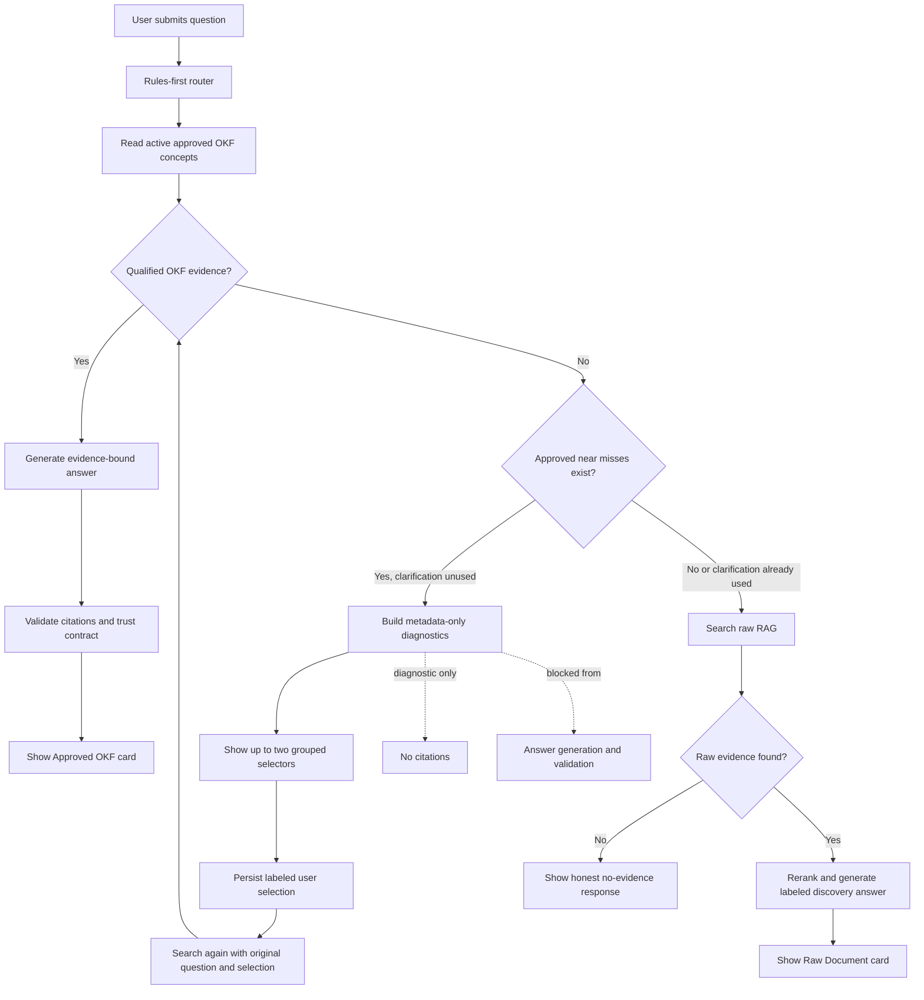

# Metadata-Driven Question Workflow E2E

## Summary

This test verifies the complete user-visible and backend question workflow for
direct approved OKF retrieval, weak-evidence metadata clarification, a resolved
clarification, and enforcement of the one-clarification-per-session rule.

The test ran through the real browser UI against the production Docker stack.
It used the configured workspace LLM provider, live OKF files, Postgres chat
storage, pgvector/RAG retrieval, Redis, and the worker. No mocked provider or
in-memory repository was used.

## Test Environment

- Local test date: 2026-07-19
- Test start: 2026-07-20T02:29:02Z
- App: `http://localhost:3000`
- Session: `cmrslwdj7000701uga8qbx9m7`
- Bundle: `Route Coverage Evaluation`
- Services: web, worker, Postgres, Redis, and MinIO all healthy before and
  after the test
- Browser console errors: 0
- Container error output during the test window: none

## Workflow Map



## Reusable User Test

### Preconditions

1. Start the Docker production stack and confirm all core services are
   healthy.
2. Configure a workspace LLM provider key in Settings.
3. Use a bundle containing:
   - an approved concept with a clear lexical title match;
   - at least two approved concepts that share a body-only query term;
   - distinct allowlisted metadata values across those near misses;
   - raw RAG content matching the weak question.
4. Ensure the near-miss concepts do not have a qualifying vector match for the
   weak test query.

### Procedure

1. Create a new chat in the test bundle.
2. Ask: `What is the approved Thermal Regulation Protocol?`
3. Confirm an Approved OKF card and the expected concept citation.
4. Ask: `What does ground leveling mean?`
5. Confirm the assistant asks one metadata clarification with no citations.
6. Select `Forklift` and `Operations Manual`, then click Continue.
7. Confirm the visible user transcript reads:
   `Subject or family: Forklift; Document type: Operations Manual.`
8. Confirm an Approved OKF answer cites `Operational Surface Preparation`.
9. Ask `What does ground leveling mean?` again in the same session.
10. Confirm no second metadata selector appears.
11. Confirm the system falls through to a Raw Document answer from
    `Route Coverage Raw Operations Log`.
12. Inspect the persisted assistant traces and verify the expected route,
    evidence status, citations, clarification data, and validation state.

## Results

| Turn | Expected | UI result | Persisted trace | Result |
| --- | --- | --- | --- | --- |
| Direct approved question | Direct OKF answer | Approved OKF card; `Thermal Regulation Protocol` source | `route=okf_only`, `finalEvidenceStatus=approved_evidence`, `okfMatchMode=lexical`, 1 citation, validation passed | Pass |
| Weak question | One structured clarification, no evidence use | Subject/family and document-type selectors; No Evidence card; 0 sources | `route=okf_only`, `finalEvidenceStatus=weak_evidence`, `metadataClarification=yes`, 0 citations, no answer validation | Pass |
| Selected follow-up | Narrow to the chosen approved concept | Natural labeled transcript; Approved OKF card; `Operational Surface Preparation` source | `metadataClarificationSelection=yes`, `finalEvidenceStatus=approved_evidence`, `okfMatchMode=lexical`, 1 citation, validation passed | Pass |
| Repeated weak question | Never ask a second clarification; use RAG fallback | No selectors; Raw Document card; `Route Coverage Raw Operations Log` source | `finalEvidenceStatus=discovery_evidence`, `rerank.status=applied`, 1 raw-RAG citation, validation passed | Pass |

## Backend Activity

The eight persisted message rows show four user turns and four assistant turns.
The important backend transitions were:

```text
direct question
  -> okf_only / approved_evidence / lexical / 1 OKF citation / validation pass

weak question
  -> okf_only / weak_evidence / 0 citations
  -> metadataClarification fields persisted
  -> answer validation intentionally not run

selected follow-up
  -> exact metadata selection persisted
  -> okf_only / approved_evidence / lexical / 1 OKF citation / validation pass

repeated weak question
  -> clarification gate already consumed
  -> raw RAG discovery / reranker applied / 1 raw citation / validation pass
```

The clarification trace contained only user-answerable metadata:

```json
{
  "subject_family": ["Forklift", "Automobile"],
  "document_type": ["Operations Manual", "Service Bulletin"]
}
```

The selected trace recorded:

```json
{
  "subject_family": "Forklift",
  "document_type": "Operations Manual"
}
```

No near-miss body text, page range, or excerpt appeared as a citation on the
clarification turn.

## Findings

### Passed

- Direct approved OKF retrieval remained unchanged.
- Weak candidates stayed diagnostic-only.
- The UI offered real, profile-allowlisted metadata values rather than free
  text or model-generated options.
- Continue remained disabled until both fields were selected.
- The pending animation appeared during each submitted turn.
- The visible transcript used natural field labels.
- The selected query found the intended approved concept.
- The clarification gate prevented a second clarification.
- The unresolved repeated query degraded to labeled raw RAG instead of
  stopping or inventing an answer.
- Citations and answer-validation states matched the evidence path.

### Follow-Up Observations

1. A clarification reply currently displays a `No evidence` card beneath the
   selector. This is technically accurate, but it can read like a failure even
   though the system is actively asking the user to narrow the search. A future
   UI refinement should consider a distinct `Clarification needed` evidence
   state.
2. Successful chat turns do not emit structured web/worker container logs.
   The persisted Postgres trace is complete and auditable, but operational
   monitoring would improve with one sanitized server log event per turn
   containing session id, route, evidence status, tool names, citation count,
   and duration. It must not log prompts, excerpts, or provider keys.

## High-Level Conclusion

The question workflow works as designed. Clear questions answer directly from
approved OKF. Ambiguous weak matches ask one structured question based on real
bundle metadata. A valid selection narrows retrieval to the intended approved
concept. If ambiguity returns after the clarification round is used, the app
continues intelligently through labeled raw RAG rather than asking repeatedly
or ending without help.

## Repeated Subjectless Follow-Up Regression

A separate clean browser session repeated `What about it?` three times. Before
the correction, later turns searched duplicated or meaningless query text,
added four broad assumptions, and repeated a generic no-evidence response.

After the correction:

```text
first subjectless question
  -> missing_context once

second and later subjectless question
  -> no query-understanding provider call
  -> no OKF/RAG retrieval
  -> no reranking or answer synthesis
  -> no assumptions or citations
  -> concise instruction to name the subject
  -> trace warning: unresolved_vague_follow_up
```

Browser session `cmrsoaayh000201qnarcm5djn` confirmed the second and third
turns behave identically. The persisted assistant trace has an empty
`retrievalToolsCalled` array. Subject-bearing short questions such as
`Explain ground leveling` remain eligible for normal retrieval.
