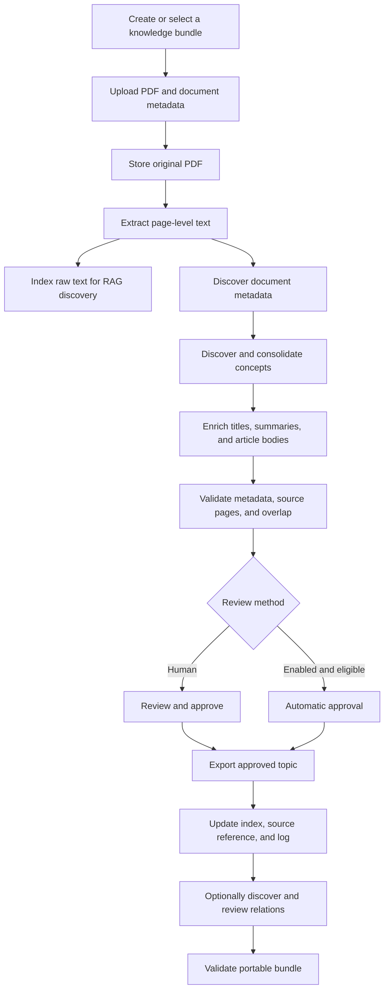

# Document-To-OKF Bundle Walkthrough

## Purpose

This guide explains how to turn source PDFs into portable Open Knowledge
Format (OKF) bundles that can be reviewed, validated, imported, and searched by
an agent.

The pipeline deliberately separates three kinds of data:

```text
Source documents -> original evidence and page references
Raw RAG index    -> unreviewed discovery over extracted text
OKF bundle       -> reviewed, structured knowledge articles
```

The PDF is the source of record. Raw RAG helps find information. The OKF bundle
contains the curated knowledge that the application may present as approved
evidence.

## Compatibility Note

AV-OKF runs a v0.2-only production runtime. Every active bundle must declare:

```yaml
okf_version: "0.2"
```

The declaration must agree in the bundle database row and root `index.md`.
Production does not fall back to v0.1. Generated concepts use the v0.2
`generated`, `verified`, `sources`, `status`, and `stale_after` families while
AV-OKF applies stricter workspace, lifecycle, approval, and source-evidence
rules before treating a concept as trusted agent evidence.

## End-To-End Pipeline



### 1. Create The Knowledge Bundle

Open `/knowledge` and create a bundle before uploading a document.

Choose:

- a name and description;
- the Generic or Aviation profile template;
- any bundle-specific profile settings.

A bundle is an independent knowledge base. Documents, topics, relations, raw
RAG, and chats stay within their assigned bundle unless the user explicitly
selects multiple bundles for a chat.

### 2. Upload The Source PDF

Open `/documents`, choose the destination bundle, and provide:

- PDF file;
- title;
- owner;
- source type;
- tags and description when available.

After upload, the application stores the PDF in object storage, creates the
document record, queues extraction, and opens the Processing panel.

The bundle assignment locks when extraction begins. This prevents derived data
from being split across bundles.

### 3. Extract Page-Level Evidence

The extraction worker reads the PDF and stores text by source page. Page
identity is preserved so every later topic and citation can refer back to the
original document.

Normal extraction states are:

```text
queued -> running -> completed
```

If extraction fails, correct the reported file or worker problem and retry.
Do not create trusted concepts from incomplete extraction.

### 4. Build The Raw RAG Index

Extracted text may be split into contextual chunks and embedded for raw
document search. The current chunking strategy is:

```text
paragraph-context-v2
```

The embedding text receives deterministic document, section, and page context.
Citation text remains the clean source excerpt.

Raw RAG is always unreviewed discovery evidence. A high retrieval score never
promotes it to approved OKF knowledge.

### 5. Discover Metadata And Concepts

The assisted authoring workflow performs:

```text
metadata discovery
-> concept discovery
-> topic enrichment
-> relation classification
-> validation
```

Concept discovery analyzes overlapping page windows and then consolidates the
results across the document. The continuation resolver can extend a topic
across adjacent pages when both pages contain compatible explicit continuation
markers.

Each topic records:

- a meaningful title;
- a concise summary;
- confidence;
- authoritative source page numbers;
- review and enrichment state;
- profile-specific metadata.

### 6. Enrich The Topic

Enrichment uses the topic title, summary, and established source pages to
produce a readable knowledge article. The source PDF remains authoritative;
enrichment may organize and explain the content but must not invent unsupported
facts.

Keep the following distinct:

```text
Raw topic       -> discovery output
Enriched topic  -> LLM-authored review candidate
Approved topic  -> content authorized for OKF export
```

### 7. Review And Approve

Human review is the default. A reviewer checks:

- title and summary;
- article body;
- source page range;
- document and profile metadata;
- page overlap with other approved topics;
- whether the content accurately represents the source.

Bundle-scoped automatic approval is optional and disabled by default. It may
approve only high-confidence, fully enriched, metadata-valid,
non-overlapping topics with established source pages. Automated approval is
recorded as a distinct provenance tier and is not presented as human review.

### 8. Export To OKF

Only approved topics can be exported. Export writes the concept Markdown file
and updates:

- `index.md`;
- the source-reference concept under `references/sources/`;
- `log.md`.

The exporter, rather than a person or external process, should update these
reserved files. This keeps the bundle and its upstream source-of-truth records
consistent.

### 9. Discover And Publish Relations

Relation discovery is optional and review-first by default:

1. deterministic signals produce candidate pairs;
2. an LLM may verify one pair and an exact source quote;
3. a human approves the relation;
4. the source concept is re-exported with typed relation frontmatter.

A bundle administrator can instead enable **Automatically create verified
relations**. New document topics are compared with approved concepts in the
same bundle. Once both endpoints are approved and exported, the worker may
publish a relation without human approval only when the verifier supplies an
exact source quote, confidence is at least 90%, and vocabulary, path, type,
duplicate, cycle, and supersession checks all pass. Automated relation
publication cannot delete or change lifecycle state.

Queued, filtered, failed, pending, and rejected candidates are not graph edges.
Only approved, exported relations enter the explorer graph or agent traversal.

## Portable Knowledge Structure

### Workspace Vault

The production vault is workspace-scoped:

```text
knowledge/
└── workspaces/
    └── {workspaceId}/
        ├── okf-vault.json
        └── bundles/
            └── {bundleId}/
                ├── okf-base.yaml
                ├── index.md
                ├── log.md
                ├── concepts/
                │   └── {type}/
                ├── procedures/
                │   └── {type}/
                ├── references/
                │   ├── sources/
                │   └── {type}/
                ├── routing/
                │   └── {type}/
                └── indexes/
                    └── {type}/
```

The bundle is the portable unit. Workspace and bundle IDs are storage
identifiers and must be generated by the receiving application rather than
copied across tenants.

### Reserved Files

| File | Purpose |
| --- | --- |
| `okf-base.yaml` | Bundle profile, allowed fields, types, statuses, relations, and hygiene rules. |
| `index.md` | Human and agent entrypoint containing links to exported concepts. |
| `log.md` | Append-only export and lifecycle history. |
| `okf-vault.json` | Workspace-level registry pointing to each bundle manifest. It lives outside the bundle. |

`index.md` and `log.md` are the OKF reserved Markdown files and are not concept
graph nodes. `okf-base.yaml` and `okf-vault.json` are AV-OKF profile and vault
artifacts. Source documents are represented as ordinary concepts under
`references/sources/`, using `av_okf_role: source_document`; they remain
visible to humans but are never answer-eligible evidence.

### Folder Placement

The active bundle profile maps each concept `type` to one folder category:

```text
concepts
procedures
references
routing
indexes
```

For example:

```text
type: procedure -> procedures/procedure/
type: system    -> concepts/system/
type: metric    -> references/metric/
```

The frontmatter `type` is the semantic identity. Folder placement is a
profile-defined organization rule and must agree with `okf-base.yaml`.

## Concept Markdown Contract

### Generic OKF v0.2 Fields

The interoperable base fields are:

| Field | Requirement | Meaning |
| --- | --- | --- |
| `type` | Required | Stable concept type identifier. |
| `title` | Optional for generic conformance | Human-readable title. |
| `description` | Optional for generic conformance | Concise concept summary. |
| `resource` | Optional | URI or bundle path for the represented resource. |
| `tags` | Optional | List of retrieval and organization keywords. |
| `sources` | Optional | Structured provenance records. |
| `generated` | Optional | Actor and timestamp for the current content. |
| `verified` | Optional | One or more verification events. |
| `status` | Optional | `draft`, `stable`, or `deprecated`; absent means stable. |
| `stale_after` | Optional | Absolute date after which the concept is stale. |

Only `type` is required for generic structural validity. That does not make a
file trusted agent evidence.

### AV-OKF Trust And Provenance Extensions

An agent-ready concept also needs:

- active lifecycle state;
- current `status: stable`;
- recognized `verified` provenance;
- a usable title and article body;
- at least one resolvable `sources[].resource`;
- one or more valid `source_pages`;
- source provenance accepted by the bundle profile.

Common extension fields include:

```text
av_okf_approval_mode
av_okf_lifecycle
source_authority
knowledge_version
subject_family
document_type
classification_code
effectivity
revision
covered_rag_chunk_ids
coverage_type
relations
```

Profiles may add domain-specific fields, but they cannot redefine the meaning
of `type`, `title`, `description`, `tags`, or `updated`.

### Complete Example

```markdown
---
type: "procedure"
title: "Vehicle Pre-Start Inspection"
description: "Checks required before operating the vehicle."
tags:
  - vehicle
  - inspection
  - safety
status: "stable"
generated:
  by: "av-okf/authoring-v1"
  at: "2026-07-26T14:30:00Z"
verified:
  - by: "human:user-id"
    at: "2026-07-26T15:00:00Z"
sources:
  - id: "source-a1b2c3d4e5f6"
    resource: "/references/sources/source-document-a1b2c3d4e5f6.md"
    title: "Vehicle Operations Manual"
source_pages:
  - 12
  - 13
source_authority: "Manufacturer operations manual"
knowledge_version: "0.1.0"
av_okf_approval_mode: "human_individual"
relations:
  - relation: "depends_on"
    target: "../../concepts/system/braking-system-a1b2c3d4e5.md"
    target_type: "system"
    reason: "The inspection requires verification of the braking system."
---

# Vehicle Pre-Start Inspection

Inspect the vehicle before operation. Verify the listed safety systems and
record any condition that prevents safe use.

## Source

- vehicle-operations-manual.pdf, pages 12-13
```

The body heading should not duplicate the title or description again
immediately. The exporter normalizes this when it creates an article.

## Relation Rules

The default relation vocabulary is:

```text
routes_to
references
supports
covered_by
supersedes
conflicts_with
depends_on
```

Each relation contains:

- `relation`;
- `target`;
- `target_type`;
- `reason`.

Targets must:

- use forward slashes;
- be relative to the source concept file;
- end in `.md`;
- stay inside the same bundle;
- resolve to an existing active concept;
- match the target's frontmatter `type`.

Do not use absolute paths, URLs, backslashes, query strings, or cross-bundle
targets.

## Packaging For Import

### Current Product Boundary

AV-OKF currently exports and validates bundles but does not provide a finished
UI or API for importing an arbitrary bundle archive. The following structure is
the import contract a future importer should consume and the recommended
handoff format for manually staged bundles.

### Recommended Handoff Package

```text
okf-handoff/
├── bundle/
│   ├── okf-base.yaml
│   ├── index.md
│   ├── log.md
│   ├── references/
│   │   └── sources/
│   └── concepts-or-profile-folders/
├── sources/
│   └── original-source-files.pdf
└── import-map.json
```

`bundle/` is the portable OKF bundle. `sources/` and `import-map.json` form an
optional AV-OKF transport envelope and are not part of the OKF specification.
Each trusted concept points through `sources[].resource` to a bundle-local
source-reference concept. That reference carries the portable
`urn:sha256:<digest>` identity; database document IDs never appear in the
bundle.

A proposed `import-map.json` shape is:

```json
{
  "transportVersion": "1",
  "bundleDirectory": "bundle",
  "sources": [
    {
      "resource": "urn:sha256:a1b2c3d4e5f6...",
      "path": "sources/vehicle-operations-manual.pdf"
    }
  ]
}
```

The mapping uses portable filenames, never database document IDs.

### Two Import Levels

**Structural import**

- imports valid Markdown and the bundle profile;
- makes concepts visible in the human explorer;
- does not automatically trust imported approval claims;
- does not provide PDF drilldown unless source documents are mapped.

**Source-linked trusted import**

- imports or maps each original PDF inside the target workspace;
- resolves each source-reference digest to a readable document in the target bundle;
- validates source pages against the extracted document;
- recreates topic-to-file projections;
- requires explicit target-workspace review before imported content becomes
  trusted agent evidence.

External `verified` events are portable provenance, not sufficient proof that
the receiving workspace approved the concept for trusted retrieval.

### Safe Import Sequence

A future importer should:

1. Extract the package into a temporary directory, never directly into the live
   vault.
2. Reject absolute paths, `..`, encoded traversal, backslashes, symlinks that
   escape the package, and duplicate normalized paths.
3. Parse `okf-base.yaml` and every Markdown frontmatter block.
4. Validate type-to-folder placement, required fields, dates, statuses, links,
   and relation targets.
5. Create a new target bundle and profile version using server-generated IDs.
6. Upload or map source PDFs within the authenticated workspace.
7. Resolve each concept's `sources[].resource` and verify its page numbers.
8. Copy the validated bundle into the new bundle root atomically.
9. Rebuild database projections, lifecycle records, backlinks, and OKF lookup
   embeddings from the Markdown files.
10. Build raw RAG only from source PDFs that were actually imported and
    extracted.
11. Require reviewer confirmation before assigning target-workspace trusted
    status.
12. Write an import entry to `log.md` and update the workspace
    `okf-vault.json`.

If any required validation fails, the importer must leave the live bundle
unchanged.

## Validation Checklist

From a bundle root, run:

```powershell
$env:PYTHONIOENCODING = "utf-8"
python -m okflint validate --manifest okf-base.yaml
python C:\projects\AV-OKF\tools\okf_relation_lint.py --manifest okf-base.yaml
```

For a workspace vault, run:

```powershell
$env:PYTHONIOENCODING = "utf-8"
python -m okflint validate --vault
```

Before accepting a bundle, confirm:

- every concept has valid YAML frontmatter;
- every concept type is defined by the profile;
- every index link resolves;
- every relation target resolves inside the bundle;
- every source-reference resource resolves through the import mapping to one
  supplied or existing source document;
- source pages are valid for the mapped document;
- reserved files were generated or reconciled, not independently hand-edited;
- generic validity and trusted-agent readiness are reported separately;
- no imported content becomes trusted without target-workspace authorization.

## Finished Result

A complete source-linked knowledge package contains:

- original PDFs outside the OKF bundle;
- page-preserving extraction records in the receiving system;
- optional raw RAG chunks for unreviewed discovery;
- reviewed Markdown concepts with portable provenance;
- deterministic index and log files plus portable source-reference concepts;
- reviewed typed relations;
- a bundle profile that describes the allowed structure;
- enough mapping information to rebuild database projections without embedding
  database IDs in the portable knowledge.

This separation keeps the OKF bundle readable and portable while allowing the
receiving application to rebuild search indexes, source drilldowns, lifecycle
state, and agent retrieval safely.
